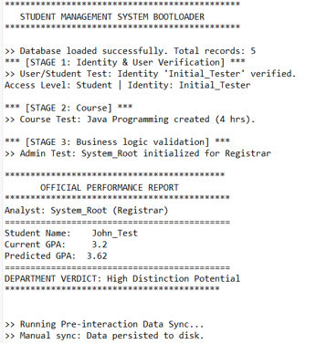
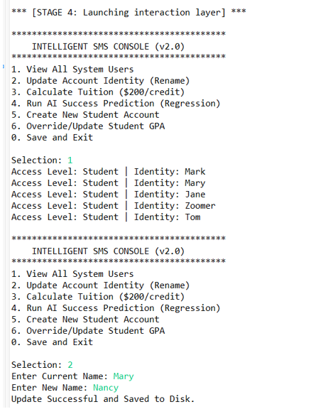
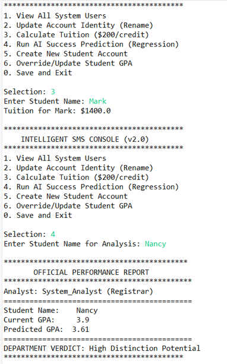
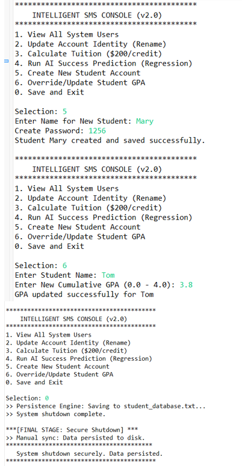
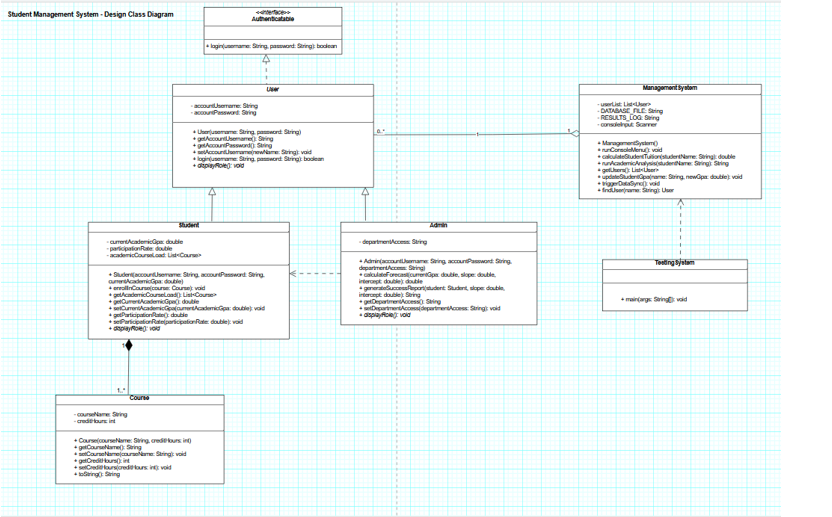
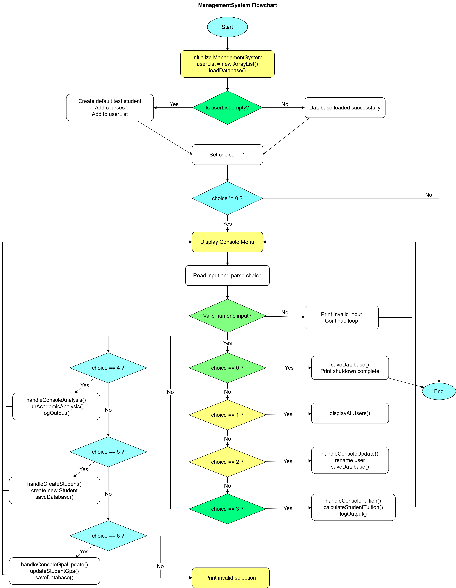

# Student Management System (Java)

A console-based Student Management System developed in Java using object-oriented programming principles.  
The application manages students, courses, GPA calculations, tuition updates, and administrative operations.

---

## Features

- Student registration and management
- Course enrollment tracking
- GPA calculation
- Tuition updates
- Administrative controls
- Data persistence using file storage
- Console-based interactive menu system

---

## Technologies Used

- Java
- Object-Oriented Programming (OOP)
- File Handling
- UML Design
- Flowchart Modeling

---
## Application Screenshots

### Console Output 1



### Console Output 2



### Console Output 3



### Console Output 4



---
## UML Class Diagram

[View SVG Version](diagrams/class_diagram.svg)



---

## Management System Flowchart

[View SVG Version](diagrams/management_system_flowchart.svg)



---

## Project Structure

```text
src/
├── Admin.java
├── Student.java
├── Course.java
├── User.java
├── Authentication.java
├── ManagementSystem.java
└── TestingSystem.java

diagrams/
├── class_diagram.png
├── class_diagram.svg
├── management_system_flowchart.png
└── management_system_flowchart.svg
```

---

## How to Run

### Compile

```bash
javac src/*.java
```

### Run

```bash
java src/TestingSystem
```

---

## Learning Outcomes

This project strengthened practical experience in:

- Object-oriented programming (OOP) and software design principles
- Java application development and console-based system architecture
- UML modeling and software architecture documentation
- Java collections, file handling, and data persistence
- Git and GitHub version control workflows
- Technical documentation and project organization

---

## Key Contributions

- Designed and developed a console-based Student Management System using Java
- Applied object-oriented programming principles including inheritance, encapsulation, abstraction, aggregation, composition, and polymorphism
- Implemented student, course, administrator, and user management logic
- Added GPA calculation, tuition processing, and academic analysis features
- Created UML class diagrams and system flowchart documentation
- Added console output screenshots to demonstrate application functionality
- Organized the project for a professional GitHub portfolio presentation

---

## Final Conclusion

This project demonstrates core software engineering and object-oriented programming concepts through a complete Java-based Student Management System.

The system highlights practical experience in Java application development, class design, data handling, academic record management, UML documentation, and GitHub-based technical presentation.

It also serves as the foundation for the extended JavaFX and DL4J version of the project, where the original console-based system evolves into an AI-enhanced educational analytics application.

---

## Author

Therese Kabayanja  
Machine Learning Engineer | Data Scientist | Software Engineer


